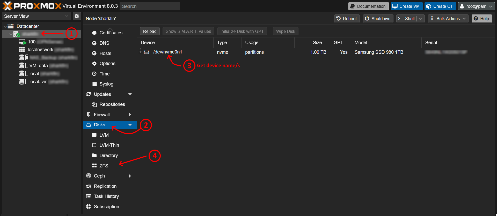
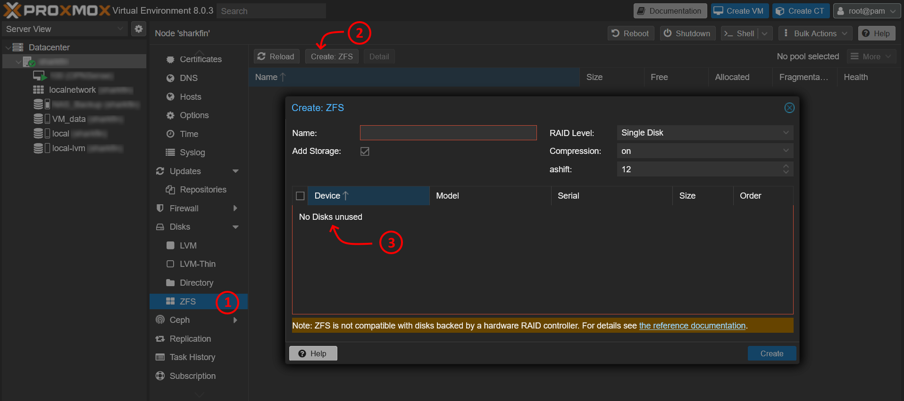
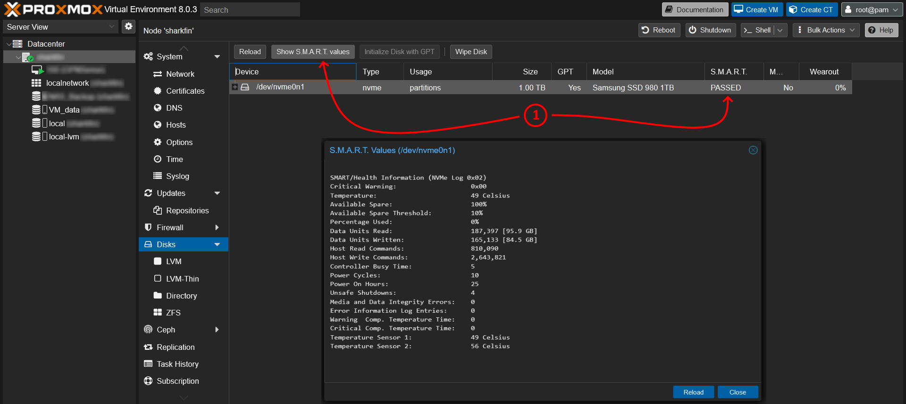
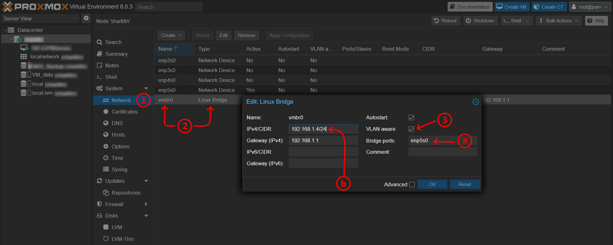
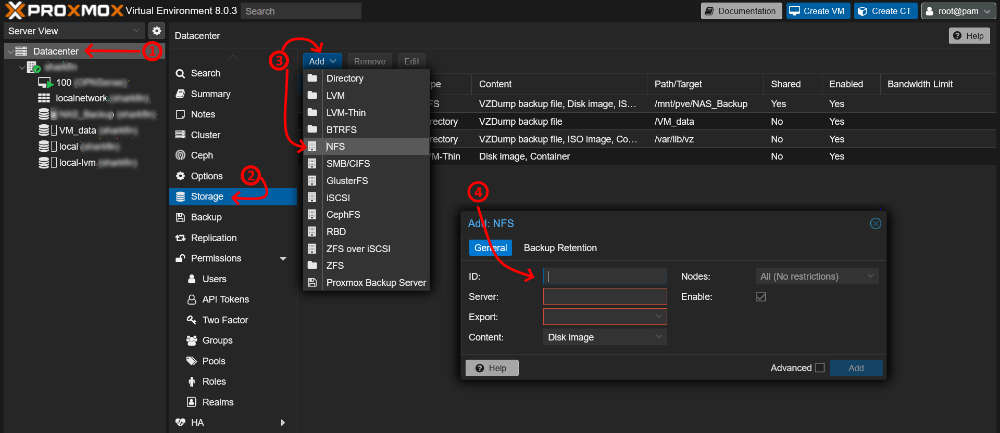

# 1. Proxmox post installation task
Task to perform after a new Proxmox Install

- [1. Proxmox post installation task](#1-proxmox-post-installation-task)
- [2. Proxmox Updates](#2-proxmox-updates)
  - [2.1. Enable updated for Proxmox](#21-enable-updated-for-proxmox)
  - [2.2. Disable Proxmox Enterprise updates](#22-disable-proxmox-enterprise-updates)
    - [2.2.1. Disable Subscription Notification](#221-disable-subscription-notification)
  - [2.3. Additional hardening / encryption measures](#23-additional-hardening--encryption-measures)
- [3. Setup Storage Options](#3-setup-storage-options)
  - [3.1. (Optional) Remove partition](#31-optional-remove-partition)
  - [3.2. Create the ZFS Pool](#32-create-the-zfs-pool)
- [4. SMART monitoring](#4-smart-monitoring)
- [5. Enable PCI passthrough (IOMMU)](#5-enable-pci-passthrough-iommu)
  - [5.1. 4.1 Configure BIOS](#51-41-configure-bios)
  - [5.2. 4.2 Update bootloader config ()](#52-42-update-bootloader-config-)
    - [5.2.1. 4.2.a For GRUB Bootloader](#521-42a-for-grub-bootloader)
    - [5.2.2. 4.2.b. For Systemd/ZFS Bootloader](#522-42b-for-systemdzfs-bootloader)
  - [5.3. 4.3 Load Kernel Modules for IOMMU](#53-43-load-kernel-modules-for-iommu)
- [6. Configure Network and VLANs](#6-configure-network-and-vlans)
  - [6.1. VLAN aware bridge](#61-vlan-aware-bridge)
    - [6.1.1. 5.1.1 VLANs: Interface, Bridge, VM](#611-511-vlans-interface-bridge-vm)
    - [6.1.2. 5.1.2 Interface VLAN setup](#612-512-interface-vlan-setup)
  - [6.2. 5.2 (Optional) Isolate / move management interface](#62-52-optional-isolate--move-management-interface)
  - [6.3. (Optional) Network Interface bonding](#63-optional-network-interface-bonding)
- [7. Setup NFS Shares](#7-setup-nfs-shares)
- [8. Optional improvements](#8-optional-improvements)
  - [8.1. Optimal VM Setting](#81-optimal-vm-setting)
  - [8.2. Disable pointer for headless / non-desktop servers](#82-disable-pointer-for-headless--non-desktop-servers)
  - [8.3. Create templates for common VM settings](#83-create-templates-for-common-vm-settings)
  - [8.4. Disable file access logging for ZFS installs](#84-disable-file-access-logging-for-zfs-installs)
- [9. Create Backups](#9-create-backups)
- [10. Define what VLAN are needed - check todie first if not already there](#10-define-what-vlan-are-needed---check-todie-first-if-not-already-there)


# 2. Proxmox Updates

## 2.1. Enable updated for Proxmox

Use GUI interface under `[Node_Name] >> Updates >> Repositories`, or update the config files in from the command line under `[Node_Name] >> Shell` and make the following changes.

```console
nano /etc/apt/sources.list
```

Ensure that the following lines are there:
ℹ️ _Proxmox 8.x uses Debian Bookworm_

```console
deb http://ftp.de.debian.org/debian bookworm main contrib
deb http://ftp.de.debian.org/debian bookworm-updates main contrib

# security updates
deb http://security.debian.org bookworm-security main contrib

# not for production use
deb http://download.proxmox.com/debian bookworm pve-no-subscription
```

## 2.2. Disable Proxmox Enterprise updates

```console 
nano /etc/apt/sources.list.d/pve-enterprise.list
```

Ensure to add a ` # ` to the start of the line, to disable pulling updates from the Enterprise branch, as this will cause update errors without a subscription.

```console
# deb https://enterprise.proxmox.com/debian/pve bookworm pve-enterprise
```

Same process to remove the apt update errors of the Ceph repository.
```shell 
nano /etc/apt/sources.list.d/ceph.list
```
```shell
# deb https://enterprise.proxmox.com/debian/pve bookworm pve-enterprise
```

Run the commands to update, and then upgrade any packages. Afterwards reboot the system.

```console
apt update
apt dist-upgrade
reboot
```

### 2.2.1. Disable Subscription Notification

To remove the subscription notification, the following file needs to be modified: `/usr/share/javascript/proxmox-widget-toolkit/proxmoxlib.js`

The following command can be used to modify this file, and would need be run after ever software update as well.
```
sed -i "s/data.status !== 'Active'/false/g" /usr/share/pve-manager/ext4/pvemanagerlib.js

## Restart the PVE service and clear the browser cache
systemctl restart pveproxy.service
```

or, the following script can be used which includes hooks that alters the file after updates.

```
wget https://raw.githubusercontent.com/foundObjects/pve-nag-buster/master/install.sh
bash install.sh
```

Uninstall with hooks created by the script:

```
sudo ./install.sh --uninstall
```

To fix / remove any changes made, re-install the module with the following command:

```
apt reinstall proxmox-widget-toolkit
```

## 2.3. Additional hardening / encryption measures
The following measures need to be investigated and in needed, integrated into this guide.
[Proxmox - Hardening](https://dustri.org/b/hardening-proxmox-against-physical-attacks.html)

# 3. Setup Storage Options
If the system uses multiple harddrives (SSD, NVME), there should be setup in as a ZFS pool. Get the device names of the drives to be used for the pool. I.e. sd**a** or nvme**1**



If the drives are not available, the partition on them needs to be removed first.




## 3.1. (Optional) Remove partition
Within the proxmox shell run the following command (replace ==XX== with the required letter)
> [!WARNING]
> Following will wipe the drives of all their data!

```console
fdisk /dev/sdXX
```
- `P` to select the partition
- `D` to delete the partition
- `9` to delete all the partitions
- `W` to write the changes

📓 Perform this for all drives

## 3.2. Create the ZFS Pool
- Enter name for the pool
  - Raid Level: `RAID10` (Recommended for speed and redunancy; needs 4 drives)
  - Compression: `On` (Recommended by Proxmox)
  - ashift: `12` (Recommended by Proxmox)
- Select all required drives
- Click `Create`

# 4. SMART monitoring
Ensure that SMART montoring is running on all the drives.




If it is not running, run the following command of all drives (replaces ==XX== with the required letter).

```console
smartctl -a /dev/sdXX
```

# 5. Enable PCI passthrough (IOMMU)  

## 5.1. 4.1 Configure BIOS
Ensure that virtualization techonology is enable within the BIOS. 
- IOMMU (I/O Memory Management Unit) is a generic name for virtualization techonology and either `Intel VT-d` or `AMD-Vi` needs to be enable, depending on the motherboard.
- More information - _Passthrough)

Reboot and verify that IOMMU is enable. Run:

```console
dmesg | grep -e DMAR -e IOMMU
```

Look for the following line: `DMAR: IOMMU enabled`. If this output is not present, double check the BIOS settings, or refer to [Proxmox Wiki](https://pve.proxmox.com/wiki/PCI_Passthrough) for trouble-shooting. 

## 5.2. 4.2 Update bootloader config ()

The bootloader needs to be updated to load the IOMMU modules. Different bootloaders are used depending on how Proxmox was installed.
- GRUB can be recognised be the default blue menu and grub written somewhere. 
- Systemd-boot (used for ZFS install) is just very plain black.
- Or run `efibootmgr -v | grep -e \EFI ` and look for `\EFI\proxmox\grub...` or `\EFI\systemd\systemd-boot...`. 

The bootloader must be configured to include:
- `[intel|amd]_iommu` to enable PCIe/IOMMU support.
- `iommu=pt` to enable passthrough, and increase device performance. Also prevents hypervisor from touching devices which cannot be passed through. 

---
### 5.2.1. 4.2.a For GRUB Bootloader

Edit the following file:

```console
nano /etc/default/grub
```

Depending on the processor, alter the line in the file to include the following:

```config
## For Intel processors
GRUB_CMDLINE_LINUX_DEFAULT="quiet intel_iommu=on iommu=pt"
## For AMD processors
GRUB_CMDLINE_LINUX_DEFAULT="quiet amd_iommu=on iommu=pt"  
```

Save the file, and update the bootloader with:

```console
update-grub
reboot
```

---
### 5.2.2. 4.2.b. For Systemd/ZFS Bootloader

Edit the following file:

```console
nano /etc/kernel/cmdline
```

Depending on the processor, alter the line in the file to include the following:

```config
## For Intel processors
root=ZFS=rpool/ROOT/pve-1 boot=zfs intel_iommu=on iommu=pt
## For AMD processors
root=ZFS=rpool/ROOT/pve-1 boot=zfs amd_iommu=on iommu=pt 
```

Save the file, and update the bootloader with:

```console
update-initramfs -u -k all
```

---
## 5.3. 4.3 Load Kernel Modules for IOMMU
With the bootloaded update, the kernal needs to be instructed to load specific modules.

```console 
nano /etc/modules
``` 

Add the following to enable the `vfio` driver and associated functions:

``` console
vfio
vfio_iommu_type1
vfio_pci
vfio_virqfd
```
> [!NOTE] 
> vfio_virqfd might not be required in the future. As of kernel 6.2 this has been folded into the VFIO driver, though this seems to be only for Arch linux. Needs to be investigated further [^1][^2]
[^1]: [Arch Linux - PCI Passthrough](https://wiki.archlinux.org/title/PCI_passthrough_via_OVMF)
[^2]: [Reddit - virqfd missing in Arch 11](https://www.reddit.com/r/archlinux/comments/11dqiy5/vfio_virqfd_missing_in_linux621arch11/?rdt=41586)

Save the file and reboot the system

```console
reboot
```


# 6. Configure Network and VLANs

## 6.1. VLAN aware bridge
Restrict the network interfaces to the required VLAN/s. Run the command:

```console
nano /etc/network/interfaces
```

Define the VLAN number/s that this Proxmox systems needs to use by adding the following:

```diff
iface vmbr0 inet static
        ...
        bridge-fd 0
+       ## Enable VLANs awareness on the switch. Tagged and untagged packet will be forwarded to all attached VMs
+       bridge-vlan-aware yes
+       ## Listen on all VLANs: 2-4094, or
+       bridge-vids 2-4094
+       ## Restrict to a specific VLAN/s (space separated list).
+       # bridge-vids 30 40 45
```

### 6.1.1. 5.1.1 VLANs: Interface, Bridge, VM

A VLAN can be created and attached to NIC interface or virtual bridge. There are different options of using them. I.e.:
1. `Interface (NIC)` -> `VLAN` -> `Bridge` -> `VM`
2. `Interface (NIC)`  -> `Bridge (VM Aware)` -> `VLAN`
3. `Interface (NIC)`  -> `Bridge (VM Aware)` -> `VM (VLAN ID)`
4. `Interface (NIC)`  -> `Bridge (VM Aware)` -> `VM` __No VLAN specified__

Each configuration option has it own benefits or disadvantages:
1. Any VM attached to this bridge will automatically be tagged with the VLAN. Thus, it is not necessary to assign an VLAN ID to the VM, nor remember which ID is necessary. The disadvantage is that the VLAN is fixed and to be able to use multiple VLAN within the VM, it will require[^1] that multiple interfaces or bridges be passed to the VM.
2. Unable to find a valid usecase for such a setup (not recommended)
3. Each VM is individually assigned a VLAN, hence the bridge works like a L3 switch. Multiple VLANs can then be processed
4. Similar to the previously point, but this setup allows the VM itself to manage or communicated over multiple VLANs. Best usecase is an OPNSense/PFSense VM setup.[^1]

[^1]:(https://forum.proxmox.com/threads/linux-vlan-bridge.91363/post-398663)

### 6.1.2. 5.1.2 Interface VLAN setup

Example setup:

```
...

## Physical NIC
iface enp4s0 inet manual

## VLAN 31 attached to NIC
auto enp4s0.31
iface enp4s0.31 inet manual

## Bridge attached to VLAN
auto vmbr2
iface vmbr2 inet manual
        bridge-ports enp4s0.31
        bridge-stp off
        bridge-fd 0
        bridge-vlan-aware yes
        bridge-vids 2-4094
...
```


## 6.2. 5.2 (Optional) Isolate / move management interface

To isolate the Proxmox management interface to a different interface, IP or VLAN; or, if moving the whole system to a different location/network, the following needs to be changed:
- from the WebUI: Under the `Datacenter` tree, select `$host_name` ==> `System` ==> `Network`.
  - Select either the required device, bridge or VLAN interface, and click `Edit`
- from the terminal, run:

```console
nano /etc/network/interfaces
```

```diff
...
## Example for the bridge (vmbr0) interface
iface vmbr0 inet static
-       address 192.168.1.2
+       address 10.10.10.2
-       netmask 255.255.255.0
+       netmask XX.XX.XX.XX  #<== (optional) if network size is different, this needs to be updated to reflect this
-       gateway 192.168.1.1
+       gateway 10.10.10.1  #<== (optional) if the gateway has changed, this need to be updated 
...
```

In addition, the `hosts` file needs to be updated to reflect the new IP of the Proxmox system. 
- from the WebUI: Under the `Datacenter` tree, select `$host_name` ==> `System` ==> `Hosts`
- from the terminal, run:

```console
nano /etc/hosts
```

In either the WebUI or terminal, change the following line with the new IP address:

```diff
...
-192.168.1.2 proxmox_system.exampledomain.com
+10.10.10.2 proxmox_system.exampledomain.com
...
```

Then save the file. The systems does **not** need to be rebooted!

## 6.3. (Optional) Network Interface bonding 
To increase network performace and redundancy, network interfaces can be bonded together (must be neighbouring interfaces).
- Indepth details and troubleshooting: [Proxmox - Networking:Bonds](https://pve.proxmox.com/wiki/Network_Configuration#sysadmin_network_bond)

**From the WebUI:**



1. Select the `Network` tab
2. Select the bridge interface, e.g. `vmbr0`
3. Enable the `VLAN Aware` checkbox
   1. (optional) Change the network interface to use for the bridge
   2. (optional) Change the IP address of the network interface

**From the command line:**

```console
nano /etc/network/interfaces
```

Add the following config options: 
 - after the interface definitions(`en0`), and
 - before the bridge definition (`vmbr0`)
 - Change the interface names and numbers: `en0` etc.

```console
auto bond0
iface bond0 inet manual
        ## Update the interface names if needed 
        bond-slaves enp5s0 enp4s0
        bond-miimon 100
        bond-mode 802.3ad
        bond-xmit-hash-policy layer2+3
```

# 7. Setup NFS Shares
> [!IMPORTANT]
> The NFS share and access rights needs to be setup first on the NAS before proceeding.



Add the following information:
- ID: Name of the share to the created (within Proxmox)
- Server: IP Address of the NAS Server
- Export: Name of the share to connect to on the NAS
- Content: What proxmox content is to be stored on the share (multi-select)
- Node: Which nodes are allowed to use this storage (multi-select)


# 8. Optional improvements

## 8.1. Optimal VM Setting
For new VMs, a good compromise for configuration setting are:
- Disks
  - Bus/Device: `VirtIO Block`. Lowest overhead
  - Discard (Checkbox): `Enabled`. Provides the "trim" operation to the VM. Useful for over-provisioning on the host
- CPU
  - Type: `Host`. **Not** recommended for clusters. The best compromised / common denominator of chipset option should then be picked
- Network
  - Model: `VirtIO` 

## 8.2. Disable pointer for headless / non-desktop servers
Save a cpu resource by disable the unnescessary pointer in the setting of the VM. Goto `⚙️ Options` => `User table for pointer` = `No`

## 8.3. Create templates for common VM settings
Quality of Life improvement: create an empty VM of the common settings to need be applied, and turn it into a template. Then attach the latest ISO image for the Operation System, when the VM needs to be created.

## 8.4. Disable file access logging for ZFS installs
By default, Proxmox logs when files are accessed by default. Disabling this can improve the performance on slower drives (HDD) or reduce writes on SSD. Atime is needed for the Garabage collector though. It should not be disable for the dataset pool. This can be disable with the following command:

```
zfs set atime=on $POOLNAME

```


# 9. Create Backups

# 10. Define what VLAN are needed - check todie first if not already there

